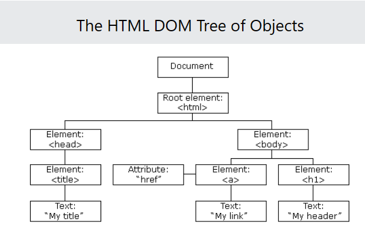
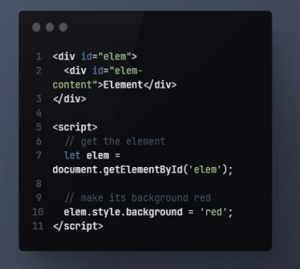
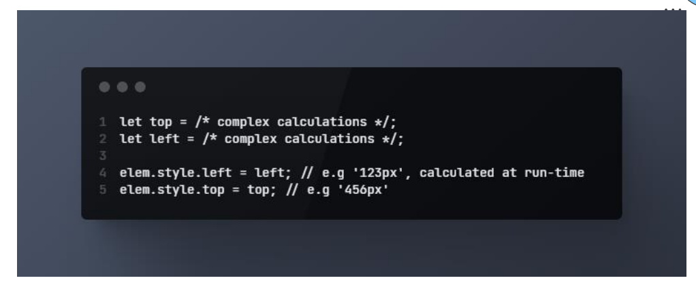
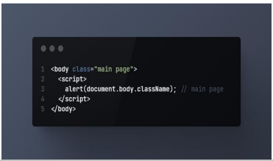
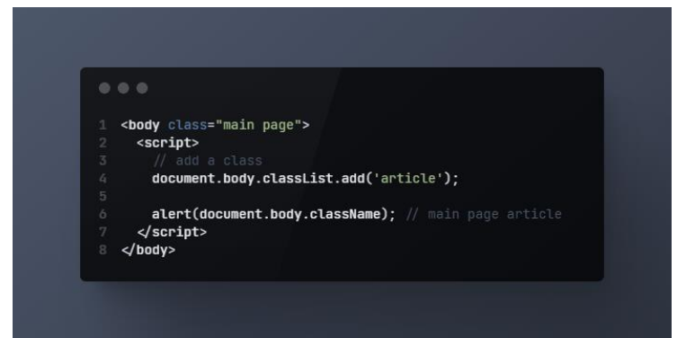
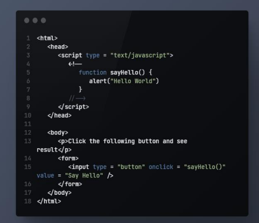
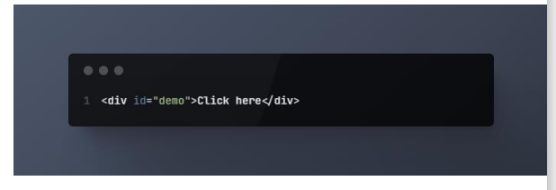
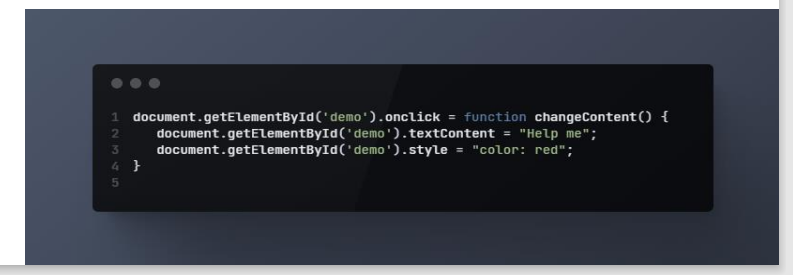
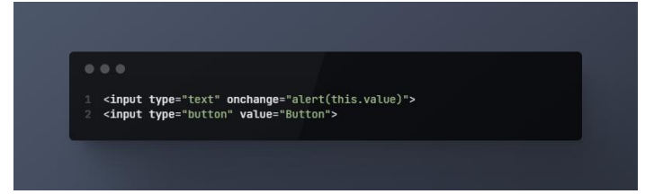

# Dom
# JavaScript HTML DOM
**With the HTML DOM, JavaScript can access and change all the elements of an HTML document.**
**With the HTML DOM, JavaScript can access and change all the elements of an HTML document.**

**With the object model, JavaScript gets all the power it needs to create dynamic HTML:**

> JavaScript can change all the HTML elements in the page
JavaScript can change all the HTML attributes in the page
JavaScript can change all the CSS styles in the page
JavaScript can remove existing HTML elements and attributes
JavaScript can add new HTML elements and attributes
JavaScript can react to all existing HTML events in the page
JavaScript can create new HTML events in the page

**What We Will Learn in Js Dom my brothers so let's see.**

> How to change the content of HTML elements
How to change the style (CSS) of HTML elements
How to react to HTML DOM events
How to add and delete HTML elements

**The DOM is a (World Wide Web Consortium) standard.**

**The DOM defines a standard for accessing documents:**

**"The  Document Object Model (DOM) is a platform and language-neutral interface that allows programs and scripts to dynamically access and update the content, structure, and style of a document."**

**The  DOM standard is separated into 3 different parts:**

**Core DOM - standard model for all document types
XML DOM - standard model for XML documents
HTML DOM - standard model for HTML documents**

**DOM является стандартом W3C (World Wide Web Consortium).
DOM определяет стандарт доступа к документам:
«Объектная модель документа W3C (DOM) — это независимый от платформы и языка интерфейс, который позволяет программам и сценариям динамически получать доступ и обновлять содержимое, структуру и стиль документа».
Стандарт W3C DOM разделен на 3 разные части:
Core DOM — стандартная модель для всех типов документов
XML DOM — стандартная модель для XML-документов
HTML DOM — стандартная модель для HTML-документов**

DOM является стандартом W3C (World Wide Web Consortium).
DOM определяет стандарт доступа к документам:
«Объектная модель документа W3C (DOM) — это независимый от платформы и языка интерфейс, который позволяет программам и сценариям динамически получать доступ и обновлять содержимое, структуру и стиль документа».
Стандарт W3C DOM разделен на 3 разные части:

Core DOM — стандартная модель для всех типов документов
XML DOM — стандартная модель для XML-документов
HTML DOM — стандартная модель для HTML-документов

# What is the HTML DOM?
**The HTML DOM is a standard object model and programming interface for HTML. It defines:**

>The HTML elements as objects
The properties of all HTML elements
The methods to access all HTML elements
The events for all HTML elements

# ```_DOM - Searching: getElement, querySelector - getElementById_```
**If an element has the id attribute, we can get the element using the method document.getElementById(id), no matter where it is.
For instance:**


# ```DOM - Searching: Styles and classes```
**Changing a class is one of the most frequently used actions in scripts.
In the ancient time, there was a limitation in JavaScript: a reserved word like "class" 
could not be an object property. That limitation does not exist now, but at that time it
was impossible to have a "class" property, like elem.class.
So for classes the similar-looking property "className" was introduced: the
elem.className corresponds to the "class" attribute.
For instance**


# DOM - Searching: Styles and classes
**If we assign something to elem.className, it replaces the whole string of classes. 
Sometimes that's what we need, but often we want to add/remove a single class.
There's another property for that: elem.classList.
The elem.classList is a special object with methods to add/remove/toggle a single 
class.**
For instance

# Introduction to browser events
**Introduction to browser events JavaScript's interaction with HTML is  handled through events that occur  when the user or the browser  manipulates a page. When the page loads, it is called an  event. When the user clicks a button,  that click too is an event. Other  examples include events like  pressing any key, closing a window,  resizing a window, etc**


# Introduction to browser events
**The onclick property of the  GlobalEventHandlers mixin is the  event handler for processing click  events on a given element. The click event is raised when the  user clicks on an element. It fires  after the mousedown and mouseup events, in that order**


# Forms, controls
**The change event triggers when the element has finished changing.
For text inputs that means that the event occurs when it loses focus.
For instance, while we are typing in the text field below – there's no event. But when we
move the focus somewhere else, for instance, click on a button – there will be a change
event**

